# 🧠 Incident Search System 
by Marcos Riquetta


---

### Description

**Incident Search System** is an AI-powered app that lets you instantly find and rank incidents by *semantic similarity*, not just keywords.  
It leverages **Sentence Transformers (`all-MiniLM-L6-v2`)** to generate embeddings for each incident title and uses **cosine similarity** to identify the most relevant matches.  

Built with **Gradio**, it offers a simple web interface where you can:
- 🔍 Type a search query  
- 🎚️ Adjust the similarity threshold  
- 📊 Instantly view matching incidents  

💡 *Think of it as an intelligent search engine for your incident database — fast, accurate, and intuitive.*

---

## 🧩 Tech Stack

| Layer | Technology | Purpose |
|-------|-------------|----------|
| 💾 Data | Pandas | Load and manage the incident dataset |
| 🧠 Model | SentenceTransformers (`all-MiniLM-L6-v2`) | Generate text embeddings |
| 📏 Similarity | Scikit-learn | Compute cosine similarity |
| 💻 Interface | Gradio | Interactive UI for searching |

---

## 🔄 Search Flow – Sequence Diagram

```mermaid
sequenceDiagram
    participant U as 🧑 User
    participant G as 💻 Gradio UI
    participant A as 🧠 AI App (Python)
    participant M as 🔤 SentenceTransformer
    participant D as 🗂️ Dataset (pandas DataFrame)

    U->>G: Enter search query + threshold
    G->>A: Call `case_search(query, threshold)`
    A->>M: Encode query → query_embedding
    A->>D: Retrieve precomputed case_embeddings
    A->>A: Compute cosine similarity (query vs cases)
    A->>A: Filter results >= threshold
    A->>A: Sort matches by similarity (descending)
    A->>D: Fetch IncidentId, Title, InternalTitle
    A-->>G: Return filtered results as DataFrame
    G-->>U: Display ranked incidents in Gradio UI

```



## ⚙️ Installation & Setup

```bash
# 1️⃣ Clone this repository
git clone https://github.com/your-username/incident-search-system.git
cd incident-search-system

# 2️⃣ Create and activate a virtual environment
python -m venv venv
source venv/bin/activate   # (Windows: venv\Scripts\activate)

# 3️⃣ Install dependencies
pip install -r requirements.txt

# 4️⃣ Prepare your dataset
# Make sure dataset.csv exists in the project root
# and contains at least the columns: IncidentId, Title, InternalTitle

# 5️⃣ Run the app
python app.py

